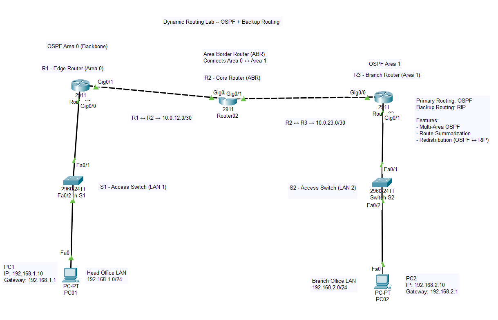

# 🌐 Dynamic Routing Lab (OSPF Multi-Area + RIP Backup)

## 📌 Overview
This project demonstrates a multi-area OSPF network with RIP as a backup routing protocol. It includes route summarization and redistribution between routing protocols.

---

## 🧠 Scenario
A company network is divided into:

- Head Office (Area 0)
- Branch Office (Area 1)

R2 acts as the **Area Border Router (ABR)** connecting both areas.

---

## 🏗️ Topology

---

## 🌐 IP Addressing

### LAN Networks
- Head Office → 192.168.1.0/24
- Branch Office → 192.168.2.0/24

### WAN Links
- R1–R2 → 10.0.12.0/30
- R2–R3 → 10.0.23.0/30

---

## ⚙️ Features Implemented
- OSPF Multi-Area (Area 0 & Area 1)
- Area Border Router (R2)
- RIP as Backup Routing
- Route Redistribution (OSPF ↔ RIP)
- Route Summarization

---

## 🧪 Verification

### OSPF Neighbors
- All routers reached FULL state

### Routing Table
- Routes learned dynamically using OSPF

### Connectivity
- PC1 successfully pings PC2

### Traceroute
Traffic path:
PC1 → R1 → R2 → R3 → PC2

---

## 🎯 Skills Demonstrated
- Dynamic Routing (OSPF, RIP)
- Multi-area network design
- Route redistribution
- Network troubleshooting

---

## 🔐 Security Note
This project is created for educational purposes only.  
No real network credentials, passwords, or sensitive data are included.  
All IP addresses used are private and for simulation only.

---

## 🚀 Author
Sachin Markali

